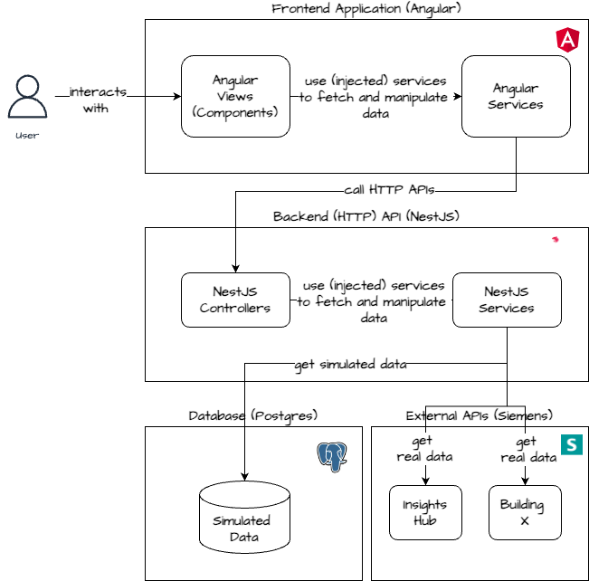
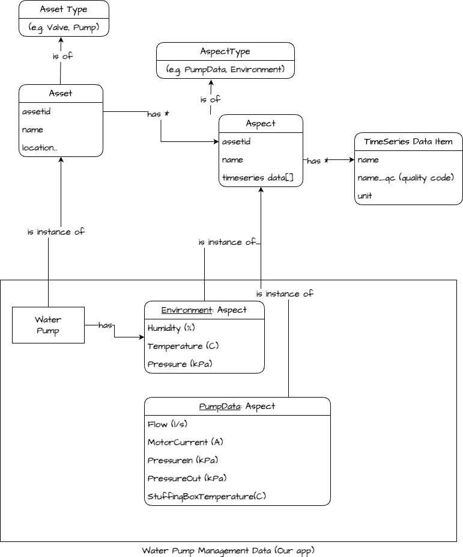

# Architecture Overview

Table of contents:

1. [Technology Stack](#technology-stack)
   - [Nx](#nx)
      - [What is Nx?](#what-is-nx)
      - [Why Nx?](#why-nx)
   - [PNPM](#pnpm)
      - [What is PNPM](#what-is-pnpm)
      - [Why PNPM?](#why-pnpm)
   - [Nest JS](#nest-js)
      - [What is Nest JS?](#what-is-nest-js)
      - [Why Nest JS?](#why-nest-js)
   - [Angular](#angular)
      - [What is Angular?](#what-is-angular)
      - [Why Angular?](#why-angular)
   - [Configurability](#configurability)
1. [Overview](#overview)
1. [Siemens IoT Model](#siemens-iot-model)

Version Information: **Version 1.0 of Sprint 02**

## Technology Stack

The chapter describes technology choices made during the development of this project.

### Nx

#### What is Nx

[Nx](https://nx.dev) is an open-source build system designed to enhance developer productivity, optimize Continuous Integration (CI) performance, and maintain code quality. It is a useful tool for managing Mono-Repositories. Mono-Repos can manage multiple apps and libraries in a single git repository.

#### Why NX

NX offers numerous enhancements for a repository such as computation caching, parallel task execution and code generators. By sharing code between apps, the mono-repo approach can help with managing the complexity of larger projects. NX also provides an overview on the project with a dependency tree between all apps and packages. It is an essential tool for Continuous Integration and automating.

### PNPM

#### What is PNPM

For our package management [PNPM](https://pnpm.io/) is a fast, disk space efficient package manager for JavaScript projects.

#### Why PNPM

PNPM distinguishes itself with its remarkable speed in package management and its ability to optimize disk space usage. This efficiency becomes increasingly crucial when developing large-scale applications, where managing dependencies can become a significant challenge.

### Nest JS

#### What is Nest JS?

[Nest](https://nestjs.com/) is an open source Node.js framework built on top of [Express](https://expressjs.com/) for building scalable, server-side applications with TypeScript. It is a common tool for developing backend applications.

It provides following abstractions:

- **Controllers:** are responsible for handling incoming HTTP-requests and returning responses back to the client.
- **Providers:** contain shared logic throughout the entire application and can be injected as a dependencies where needed.
- **Modules:** allow code to be organized into smaller chunks where it can be lazy loaded to run faster in serverless environments.

NestJS offers support for multiple packages for integration with various databases, messaging systems and other services.

#### Why Nest JS?

Nest JS has its own CLI-Tool and comes preconfigured with a Testing framework. Nest also makes use of annotations similar to Java, which keeps the code more organized and readable. Nest JS is built with modularity in mind, allowing developers to organize code into reusable modules. This approach enhances scalability by enabling the application to grow and evolve without becoming unwieldy or difficult to maintain. In addition, Nest JS is built on top of TypeScript, a statically typed superset of JavaScript. TypeScript provides robust type checking and compile-time error detection, leading to more reliable and maintainable code.  

When choosing the framework for our project, Nest JS's resemblance to Angular and its cohesive structure resonated strongly with most team members. Being written in TypeScript was an additional welcoming aspect for most of the team, as it makes the development more consistent and may also reduce the learning curve for less experienced developers. Furthermore, most of the team members welcomed the framework being in TypeScript as it keeps the overall project more consistent.  

### Angular

#### What is Angular?

Angular is a component-based framework for building user interfaces written in TypeScript. It emphasizes a component-based architecture, enabling developers to create reusable UI components and manage application logic efficiently.

#### Why Angular?

Like Nest JS, Angular has its own CLI-tool and comes preconfigured with various things such as routing and a testing framework. It also offers a more modular structure, enabling developers to build reusable components that can be used across different parts of an application, enhancing code reusability and maintainability. Moreover, Angular supports dependency injection. It keeps the code very organized and readable by using annotations and separating HTML code from TypeScript in its Components.

One argument for using Angular was the fact that some of the team members already had experience with the framework. Additionally, Siemens has its own open-source component library (Siemens Industrial Experience) containing numerous icons, themes components etc. One the one hand, it allows us to keep the usability of the application in the style of Siemens, On the other hand, Siemens Industrial Experience supports a wide range of frameworks such as Angular, React and provides an established set of professionally designed components. All in all, it can be said that Angular makes a solid foundation for our frontend application.

## Configurability

One of the main requirements for this project was the configurability. We wanted to make sure that our application can be easily configured and customized for different deployment scenarios. As both Nest JS and Angular use Dependency Injection to inject dependencies into components, we felt that this is a good fit for our project.

## Overview

Our application mainly consists of three parts:  

1. The frontend application (Angular)
2. The backend API (NestJS)
3. The database (Postgres)

When modeling the architecture, we prioritized separation for separation of concerns. The idea is to have each application focus on a singular task. Frameworks such as Angular and Nest JS support a strong cohesion with a modular approach.

However, it is important to note that our design is still at the beginning stage of the project. We are trying to aim for an emergent design: The Design is created iteratively and only a few requirements are implemented at a time. The rest is implemented as required during development. Nevertheless, one challenging aspect is that our design might end up “interwoven” due to the high amount of attachments. If the initial design is bad, it's hard to get away from it.

## Siemens IoT model

As our application is primarly dealing with Industrial IoT data, the following chapter explains our understanding of the Siemens IoT model.

An **Asset** is the root entity that represents a physical object in the IoT ecosystem that generates data. Such assets could be valves, engines, gas turbines, water pumps, trains or buildings.

Each **Aspect** is associated with many Assets. It groups related data points based on their logical association. An Aspect helps organizing and categorizing the data within the Asset.

**Time series data** is stored against an asset and an aspect. A time series record consists of a timestamp, one or more values, and an optional quality indicator for each variable, which is defined by the aspect type. Within the IoT Time Series Service companies can store and query time series data with a precision of 1 millisecond.

Each **TimeSeriesItem** represents the actual data points collected over time for each property within a property set. This can be the pressure, flow or temperature of a pump machine at a specific time.

### Water Pumps in the Siemens IoT Model

In our application we are dealing with (simulated) **water pumps**. The **water pumps** are assets of asset type **Pump** and they have two aspects: Environment and PumpData. The timeseries properties are described in the diagram below.

