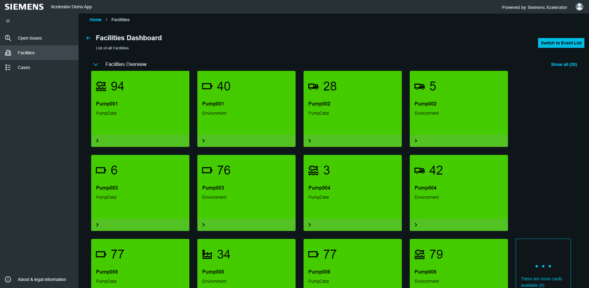
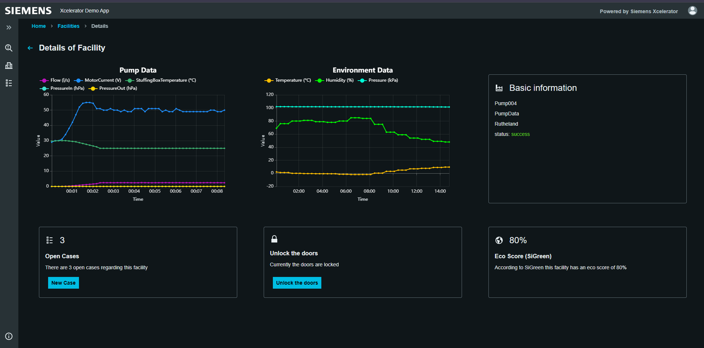
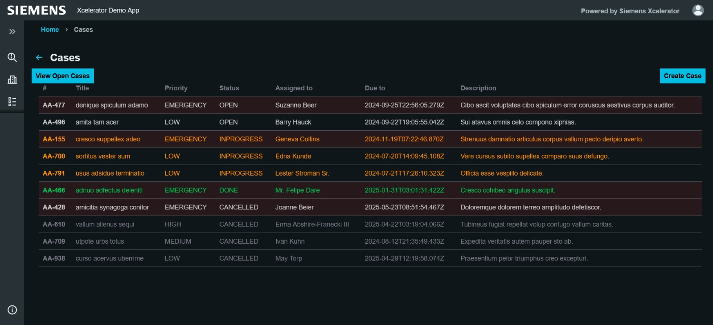

# Amos Project: Siemens Xcelerator

## Siemens Xcelerator Demo Application

### Goal

This project showcases the [Siemens Xcelerator](https://xcelerator.siemens.com), illustrating Siemens' comprehensive digital execution platform that spans various industries.
This demo application demonstrates the capabilities of Siemens Xcelerator, by simulating a management platform for a water treatment facility.

The user is able to monitor individual pumps, which are located in different facilities. This includes the display of the metrics for each pump,
and the ability to create cases. These cases are maintenance orders for, e.g. technicians, to maintain or inspect faulty devices.

### Developer Platform

Siemens provides extensive developer tools to help organizations create impactful solutions.
More details are available in [Siemens Xcelerator Developer Portal](https://developer.siemens.com). The frontend of the application was built using [Siemens Inudstrial Experience (iX)](https://ix.siemens.io) framework.

### Outcome

**Developers:** Gain access to Siemens' easy-to-use tools through Xcelerator, simplifying solution development.
**Companies:** Understand how Siemens Xcelerator aids in solving today's complex challenges.

### AMOS Project

[AMOS](https://oss.cs.fau.de/teaching/the-amos-project/) = Agile Methods and Open Source

Students learn Scrum by developing an open source software as a team project over the course of a semester, for an industry partner.
The team consist of students from the FAU, TU Berlin and FU Berlin.  

## Overview of the Application

.png)

## Link to the architecture Document

[Architecture project wiki page](https://github.com/amosproj/amos2024ss01-xcelerator-demo-app/wiki/Architecture)

## The Team

* Cecilia Betancourt Barrita
* Shahraz Nasir
* Lama Rajjo
* Jonas Heisterberg
* Maximilian Krug
* Alexander Lorenz
* David Schmidt
* Patrick Schmidt
* Ingo Sternberg
* Saša Bojanić
